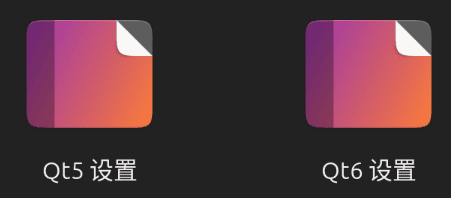
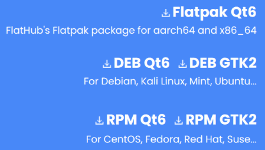

# <center>`GTK` 深色模式</center>

## `GTK 3`

使用以下命令可以设置 `GTK 3` 应用的样式：

```bash
gsettings set org.gnome.desktop.interface gtk-theme '主题名称'
gsettings set org.gnome.desktop.interface icon-theme '主题名称'
gsettings set org.gnome.desktop.interface cursor-theme '主题名称'
```

可以用以下命令查询已安装的主题名称：

```bash
ls /usr/share/themes
```

紫色文本就是已安装的主题名称：


## `GTK 2`

在 `~/.gtkrc-2.0` 文件内加入以下代码。
**注意**：本方法用 `PeaZip` 实践暂无效果

```bash
gtk-theme-name="主题名称"
gtk-icon-theme-name="主题名称"
gtk-application-prefer-dark-theme=1
```

# <center>`QT` 深色模式</center>

## 安装 `QT` 配置工具

```bash
sudo apt install qt5ct
sudo apt install qt6ct
```

安装后，应用界面中会出现这两个应用：



## 怎么知道应用框架是 `QT5` 还是 `QT6` ？

- 从下载页面得知

  比如 `PeaZip` 的 [Linux版本下载页面](https://peazip.github.io/peazip-linux.html){:target="_blank"} 会显示：

  

- 从应用的**关于**页面得知

  比如 `PeaZip` 的**关于**页面：

  

## 设置环境变量

打开 `~/.profile`，添加如下语句：

```bash
export QT_QPA_PLATFORMTHEME=qt6ct
```

保存后重启。
